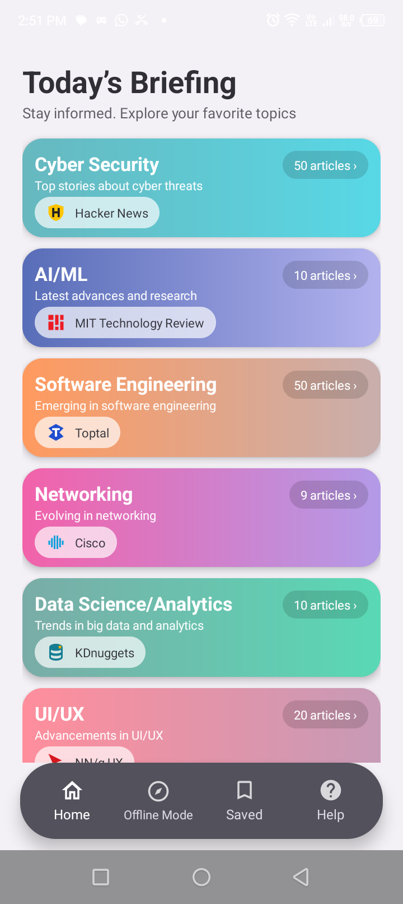
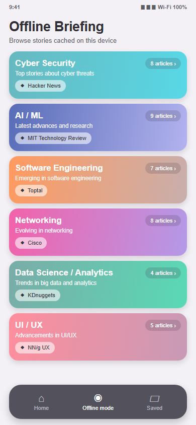
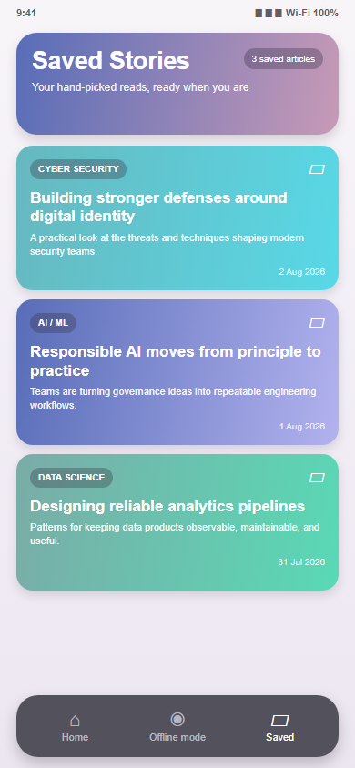
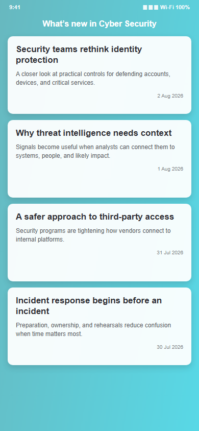
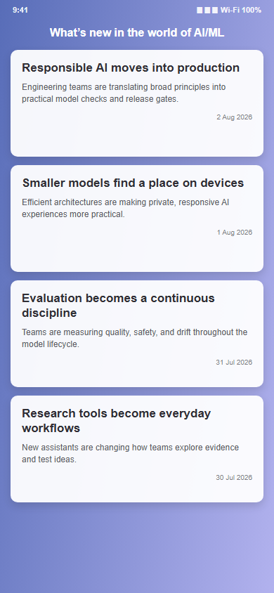
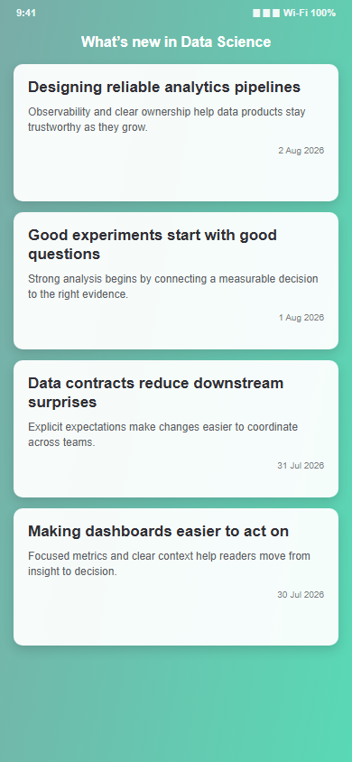

<h1> Update</h1>

Update is an Android technology-news reader covering six domains:

- Cyber Security
- Artificial Intelligence and Machine Learning
- Software Engineering
- Networking
- Data Science and Analytics
- UI/UX Design

The app downloads articles from public RSS feeds, caches them in Room for offline browsing, opens full stories in an in-app WebView, and maintains a separate list of saved articles.

## UI preview

These documentation previews reflect the current XML layouts, colors, gradients, navigation states, source branding, and screen content hierarchy.

| Home | Offline mode | Saved stories |
| --- | --- | --- |
|  |  |  |

| Cyber Security | AI / ML | Data Science |
| --- | --- | --- |
|  |  |  |

## Features

- Browse current technology news across six color-coded categories.
- Recognize each category's publisher through its own colored source mark.
- See cached article counts directly on the Home and Offline category cards.
- Read full articles in an in-app WebView.
- Cache fetched articles locally with Room.
- Browse cached article summaries without an internet connection.
- Long-press an online or offline article to save it.
- Long-press a saved article to remove it.
- See an empty state and live saved-item count on the Saved Stories screen.
- Move between Home, Offline mode, Saved, and Help using a persistent bottom navigation bar.
- Identify the current navigation destination through active text and icon styling.
- Restrict Offline mode consistently until at least one article has been cached.
- Distinguish unavailable internet access from slow feed responses and timeouts.
- Offer Wi-Fi settings, retry, or Offline mode when the app launches without internet access.
- Show the modern Update identity across the launcher, splash screen, and branded in-app messages.
- Display compact Material loading indicators while network or database work completes.

## Implemented changes

### Home and category redesign

- Replaced the original home layout with a briefing-style screen.
- Added six reusable category cards with descriptions, colored publisher marks, source chips, cached counts, and individual gradients.
- Refined the spacing between category descriptions, source logos, and source labels.
- Added a matching Offline Briefing screen.
- Applied each category card gradient to its online and offline article screens.
- Added persistent Home, Offline mode, Saved, and Help navigation with an active destination state.

### Branding and interaction polish

- Introduced a modern globe-and-signal logo for the launcher and round launcher icon.
- Preserved the original `app_icon2.png` asset while switching active UI references to the new branding.
- Added density-specific launcher assets from mdpi through xxxhdpi.
- Added a five-second launch screen with the Update logo, developer credit, and visible countdown timer.
- Reused the modern logo in branded Toast messages instead of showing Android's generic icon.
- Added rounded clipping so the logo renders cleanly on the launch screen and compact Toast surface.
- Restored Help as the final bottom-navigation action and reused the shared Help dialog across primary screens.
- Kept the Offline mode label centered and on one line throughout the bottom navigation.

### Saved Stories and loading states

- Rebuilt Saved Stories with a lavender surface, gradient header, saved count, and styled empty state.
- Added category-aware gradients to saved article cards.
- Updated deletion handling so counts and the empty state respond immediately.
- Replaced the rendered Lottie loaders with formal Material circular progress indicators.
- Added app-branded feedback messages for saves, removals, offline restrictions, empty categories, and feed failures.

### Centralized application executors

- Added `AppExecutors` as the application-wide executor provider.
- Routed manual database work through the ordered disk executor.
- Routed connectivity and WebView checks through the network executor.
- Routed asynchronous UI callbacks through the main-thread executor.
- Left WorkManager jobs on WorkManager-managed background threads to avoid redundant executor nesting.

### Shared RSS pipeline

- Centralized all publisher URLs, Room categories, and worker keys in `FeedSource`.
- Added one reusable OkHttp client with explicit timeouts and response handling.
- Replaced six duplicated XML parsers with one namespace-aware RSS parser.
- Added fallbacks for Atom-style links, summary/content fields, alternate dates, and URL-based GUIDs.
- Added an `ArticleRepository` to coordinate download, parsing, validation, and Room persistence.
- Replaced six category workers with one configurable `ArticleRefreshWorker`.
- Made category replacement transactional so failed or empty refreshes do not erase valid cached articles.
- Added parser, network-client, and worker-input tests.

### RecyclerView safety

- Article click and long-press callbacks resolve the current adapter position at interaction time.
- Removed stale bind-position captures and guarded `RecyclerView.NO_POSITION`.
- Long-press interactions are consumed so they do not also trigger the regular click action.

### Organized layout resources

- Split the original flat layout collection into Home, Categories, Offline, Saved, Cards, Loading, and Web resource roots.
- Kept resource filenames unchanged so `R.layout.*` and `@layout/*` references remain stable.
- Configured Gradle to merge all grouped roots into the application's single Android resource namespace.

## News sources

| Category | RSS source |
| --- | --- |
| Cyber Security | The Hacker News |
| AI/ML | MIT Technology Review |
| Software Engineering | Toptal Engineering Blog |
| Networking | Cisco Networking Blog |
| Data Science | KDnuggets |
| UI/UX | Nielsen Norman Group |

All six feeds currently expose conventional RSS items with `title`, `description`, `link`, and `pubDate`. The shared parser ignores publisher-specific namespace fields and supports a small set of defensive RSS and Atom fallbacks.

## How it works

Each online category uses the same refresh pipeline:

```text
Category Activity
      |
      v
ArticleRefreshWorker + FeedSource input
      |
      v
ArticleRepository
      |
      +--> RssFeedClient / shared OkHttpClient
      |
      +--> RssParser
      |
      v
Transactional category replacement in Room
      |
      v
LiveData observation in the Activity
      |
      v
RecyclerView article list
```

Room is the offline article cache. Saved Stories use a separate Gson-serialized list in `SharedPreferences`.

## Technology stack

- Java 11
- Android Views and XML layouts
- AndroidX AppCompat and Material Components
- WorkManager for constrained background refreshes
- Room and LiveData for cached article storage and observation
- OkHttp for RSS downloads
- SAX for namespace-aware XML parsing
- RecyclerView and CardView for article lists
- Gson and SharedPreferences for saved articles
- JUnit and MockWebServer for local tests

## Requirements

- Android Studio with a compatible JDK; Android Studio's bundled JDK works
- Android SDK 35 for compilation
- An Android device or emulator running Android 12/API 31 or newer
- Internet access for fetching live news and opening full articles

The application currently uses:

- `compileSdk 35`
- `targetSdk 34`
- `minSdk 31`

## Getting started

1. Clone or download the project.
2. Open the `Update v2/Update` directory in Android Studio.
3. Allow Gradle to synchronize and download the required dependencies.
4. Select an Android 12 or newer device or emulator.
5. Run the `app` configuration.

To build from Windows:

```powershell
.\gradlew.bat assembleDebug
```

On macOS or Linux:

```bash
./gradlew assembleDebug
```

The generated debug APK is placed under `app/build/outputs/apk/debug/`.

## Using the app

1. Select a category from Today’s Briefing to refresh and display its articles.
2. Tap an online article to open the full page in the in-app browser.
3. Long-press an article and confirm to save it.
4. Open Saved to view, count, open, or remove saved stories.
5. Open Offline mode to browse summaries previously cached in Room.

Offline mode becomes available after articles have been fetched successfully at least once. Full web articles still require an internet connection.

## Project structure

```text
app/src/
|-- main/
|   |-- AndroidManifest.xml
|   |-- java/com/systemtech/update/
|   |   |-- MainActivity.java              # Home briefing and connectivity handling
|   |   |-- SplashActivity.java            # Branded five-second launch countdown
|   |   |-- *Activity.java                 # Online category screens
|   |   |-- OfflineActivity.java           # Offline briefing
|   |   |-- SavedPreferencesActivity.java  # Saved Stories screen
|   |   |-- WebPageActivity.java           # In-app article browser
|   |   |-- Utils.java                     # SharedPreferences saved-article storage
|   |   |-- adapters/                      # RecyclerView adapters
|   |   |-- backgroundTasks/
|   |   |   `-- ArticleRefreshWorker.java  # Generic WorkManager refresh worker
|   |   |-- database/                      # Room entity, DAO, and database
|   |   |-- feeds/                         # FeedSource, client, parser, and repository
|   |   |-- helpers/
|   |   |   |-- AppExecutors.java          # Disk, network, and main-thread executors
|   |   |   |-- BrandedToast.java          # App-branded feedback messages
|   |   |   |-- NetworkStatus.java         # Validated connectivity checks
|   |   |   `-- OfflineModeNavigator.java  # Shared cached-article access guard
|   |   `-- offlineMode/                   # Offline category screens
|   |-- res/
|   |   |-- drawable/                      # Gradients, clipping, icons, and surfaces
|   |   |-- drawable-nodpi/                # High-resolution modern app logo
|   |   |-- mipmap-*/                      # Density-specific launcher icons
|   |   `-- values/                        # Strings, colors, fonts, and themes
|   `-- res-layouts/                       # Grouped layout resource roots
|       |-- home/layout/                   # Home briefing
|       |-- categories/layout/             # Six online category screens
|       |-- offline/layout/                # Offline briefing and category screens
|       |-- saved/layout/                  # Saved Stories screen
|       |-- cards/layout/                  # Cards, article rows, and branded Toast
|       |-- loading/layout/                # Loading includes and branded launch screen
|       `-- web/layout/                    # In-app WebView screen
|-- test/                                  # Parser and MockWebServer tests
`-- androidTest/                           # Android worker-input tests
```

## Testing

Run local unit tests:

```powershell
.\gradlew.bat testDebugUnitTest
```

Build the app and instrumentation-test APK:

```powershell
.\gradlew.bat assembleDebug assembleDebugAndroidTest
```

Run Android lint:

```powershell
.\gradlew.bat lintDebug
```

The local unit tests, debug build, Android test build, and lint task currently complete successfully.

## Current limitations

- Online category Activities and offline category Activities still contain similar presentation logic.
- Offline data refreshes only after its online category has completed a successful refresh.
- Some RSS descriptions may contain HTML markup that is displayed as plain text.
- Saved articles are not deduplicated.
- Saved Stories are stored independently from the Room offline cache.
- Full articles cannot be opened in offline mode.
- The legacy Lottie dependency and raw animation asset remain in the project even though the active loaders use Material progress indicators.
- Automated UI and end-to-end coverage is still limited.

## Permissions

The app requests:

- `android.permission.INTERNET` to download RSS feeds and load article pages.
- `android.permission.ACCESS_NETWORK_STATE` to inspect connectivity.

## License

No project-level license has been added to this repository.
